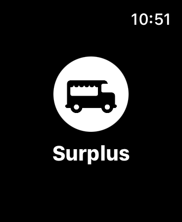
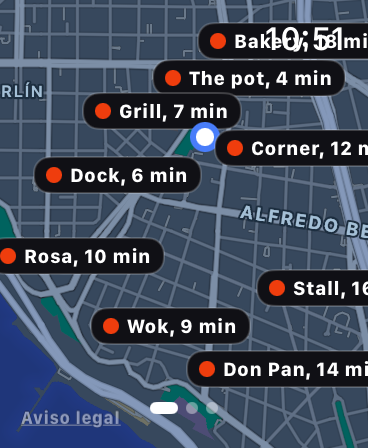
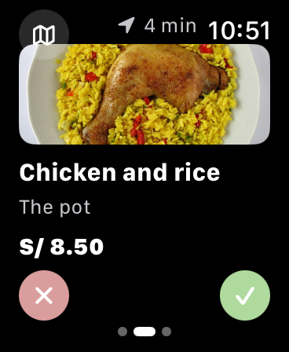
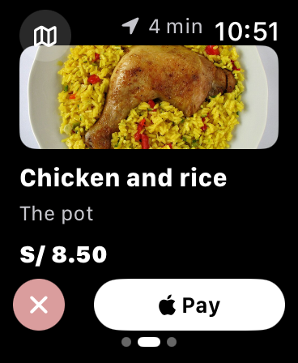
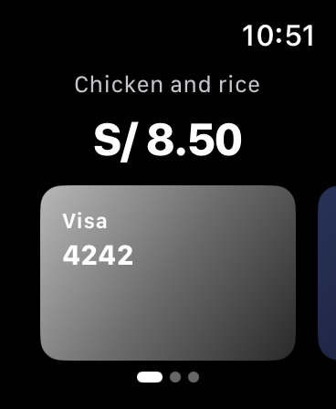
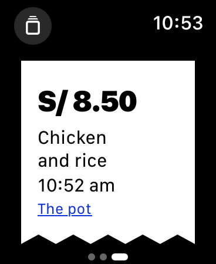
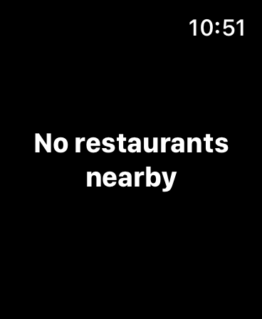

# Surplus

Apple Watch app for picking up known surplus food from a nearby restaurant.

By [Shiara Arauzo](https://github.com/shiarauzo). The project lives at [github.com/shiarauzo/surplus](https://github.com/shiarauzo/surplus).

The food is a specific dish, not a surprise bag. Every pickup costs the same, S/ 8.50. The watch shows that price. Paying is a simulated Wallet sheet. Nothing is charged, and Apple Pay does not ask for a Surplus account.

## On the watch

Surplus is watch-only. There is no iPhone companion.

1. The splash is the cart mark and the name.
2. The first launch explains the gesture. Later launches open on the map.
3. The map shows nearby restaurants. The page dots at the bottom open the foods.
4. Each food is one card: the dish, the restaurant, the walk time, and the price. Swipe left or tap X to pass. Swipe right or tap the check when you want it. The check reveals Pay.
5. Pay opens three cards. Scroll to the one you want and tap it.
6. The receipt shows the price, the dish, the time, and the restaurant. The button at the top left returns to the foods that are still there.
7. When nothing is left, the watch says so.

Passing a food does not bring it back in that session. The first person to pay gets it. Stopping on a card is looking, not reserving.

These are the screens from the Apple Watch simulator.

<p>
  
  
  
  
</p>
<p>
  
  
  
</p>

## See it

Open [shiarauzo.github.io/surplus](https://shiarauzo.github.io/surplus) to step through the screens. Nothing to install.

## Run

The app itself runs on the Apple Watch simulator, from this repository.

You need a Mac with Xcode and the watchOS 26 simulator.

```sh
git clone https://github.com/shiarauzo/surplus.git
cd surplus
open Cerca.xcodeproj
```

In Xcode, choose the **Cerca** scheme and an Apple Watch simulator, then run. The app on the watch is named Surplus.

The sample restaurants sit in Miraflores, Lima. The map is a real Apple map, so it can be panned and zoomed.

## Test

UI tests live in `CercaUITests` and drive the wearer flow on the simulator.

```sh
xcodebuild -project Cerca.xcodeproj -scheme Cerca \
  -destination 'platform=watchOS Simulator,name=Apple Watch SE 3 (44mm)' \
  CODE_SIGNING_ALLOWED=NO test
```

## Photos

The plate photos are test data, cropped from Wikimedia Commons. Attribution is in `Cerca/PhotoCredits.txt`.
